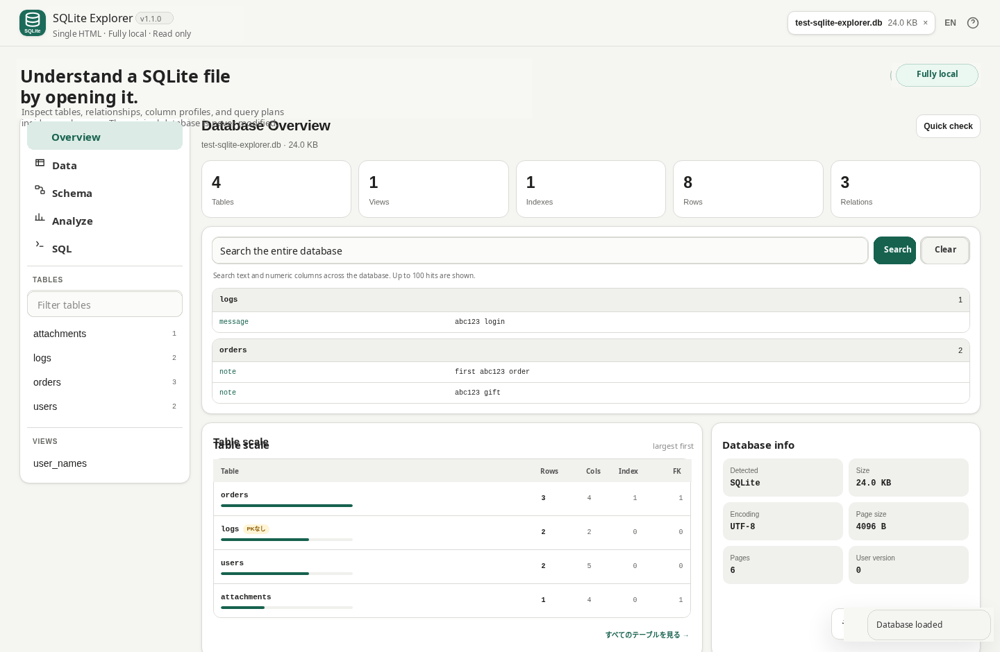
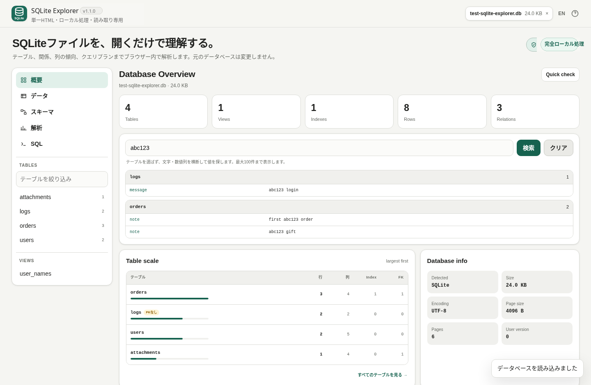

# SQLite Explorer

[](https://github.com/ttomohisa/htmlapps-sqlite-explorer/actions/workflows/deploy-pages.yml)
[](LICENSE)
[](https://ttomohisa.github.io/htmlapps-sqlite-explorer/)
[](#read-only-design)

[日本語版 README](README.ja.md)

A privacy-focused, single-HTML SQLite explorer for opening an unfamiliar database and quickly understanding its structure, relationships, data, and query behavior without uploading the database to a server.

## 🚀 Live demo

### [Open SQLite Explorer on GitHub Pages](https://ttomohisa.github.io/htmlapps-sqlite-explorer/)

GitHub Pages delivers the initial HTML. After it loads, SQLite parsing, table browsing, profiling, relationship inference, SQL execution, query-plan analysis, export, and health checks all run locally on your device. The SQLite file you select is not uploaded by the app.

No installation or account is required.

## Screenshots

### English UI



### 日本語 UI



## What's new in v1.1.0

- Database-wide value search for unknown schemas
- Data Explorer upgrades: row filter, sortable columns, column visibility toggles, and resizable headers
- Smart Cell Inspector with JSON/date/URL/UUID/Base64/BLOB detection
- Record Relationship Explorer for moving from one row to related rows
- Database Health score with structural warnings, `quick_check`, and `foreign_key_check`
- ER diagram Focus Mode for isolating a table and its direct neighbors

## Features

- Open `.db`, `.sqlite`, `.sqlite3`, and other standard SQLite database files in the browser
- Database overview with table, view, index, row-count, page-size, encoding, and other metadata
- **Table scale** view showing rows, columns, indexes, foreign keys, and primary-key warnings at a glance
- Jump directly from the overview to a table in the Data Explorer
- **Database-wide value search** across text and numeric columns without knowing the schema first
- Row filtering, column sorting, column visibility toggles, and resizable columns in Data Explorer
- **Smart Cell Inspector** for JSON, URLs, UUIDs, possible timestamps, Base64 candidates, and BLOBs
- Inline PNG / JPEG / GIF / WebP BLOB previews
- **Record Relationships** for following declared and inferred relationships from a selected row
- **Database Health** combining structural warnings, `quick_check`, and `foreign_key_check`
- ER diagram Focus Mode for showing only a selected table and its direct neighbors
- Paginated table browsing without rendering the entire table into the DOM
- Export table data and query results as CSV or JSON
- Schema and DDL viewer
- ER diagram for declared foreign keys
- **Relationship inference** for likely undeclared relationships based on column names, SQLite type affinity, and sampled value overlap
- Solid lines for declared foreign keys and dashed lines for inferred relationships
- Column profiler with NULL count/rate, distinct values, top values, type, and primary-key information
- Read-only SQL editor with `Ctrl` / `⌘` + `Enter` execution
- `EXPLAIN QUERY PLAN` visualization for plannable queries
- `PRAGMA quick_check` from the overview
- Japanese and English UI in the same HTML
- Desktop database-tool layout and touch-friendly mobile bottom navigation
- Embedded SVG favicon
- Version-pinned `sql.js` embedded into the generated HTML
- Content Security Policy with runtime network connections blocked

## Quick start

### Use the web demo

Just [open the demo](https://ttomohisa.github.io/htmlapps-sqlite-explorer/), choose a SQLite file, and start exploring it.

The selected database stays in the browser and is not uploaded by this app.

### Use it fully offline

1. Download or clone this repository.
2. Double-click `build-standalone.bat` on Windows.
3. The first build downloads the exact `sql.js` version pinned in `dependencies.json`.
4. Open the generated `dist/index.html`.
5. Copy that one file wherever you need it and open it later without an internet connection.

Python, Node.js, and a local web server are not required. The builder uses Windows PowerShell and the built-in `tar.exe`.

A self-extracting version is also generated as `dist/index.self-extract.html`.

## Usage

1. Drop a SQLite file onto the start screen, or choose one with the file picker.
2. Use **Overview** to understand the database at a glance.
3. Open **Data** to browse a table or view and export it as CSV / JSON.
4. Open **Schema** to inspect DDL, the ER diagram, declared foreign keys, and inferred relationships.
5. Open **Analyze** to profile columns and inspect NULL / distinct / top-value statistics.
6. Open **SQL** to run read-only queries and inspect `EXPLAIN QUERY PLAN` output.

### Overview

The overview is designed to answer “what kind of database is this?” before you start opening tables one by one.

It includes:

- Number of tables, views, indexes, and rows
- SQLite page size, encoding, and database metadata
- Table-scale ranking with row, column, index, FK, and PK information
- Relationships detected from declared and inferred foreign keys
- Observations such as tables without primary keys and foreign-key columns that may lack a matching index
- Database-wide value search
- Database Health score with structural checks, `PRAGMA quick_check`, and `PRAGMA foreign_key_check`

### Data Explorer

- Select a table or view from the navigation or selector
- Browse rows in pages of 100
- Filter across the current table
- Sort by clicking a column header
- Toggle visible columns and resize headers
- Click a cell to inspect JSON, dates, URLs, UUIDs, Base64 candidates, and common BLOB formats
- Use the row `↗` action to follow records referenced by or referencing the current row
- Export the selected table as CSV or JSON

### Schema & relationships

SQLite Explorer distinguishes between two kinds of relationships:

- **Declared FK** — relationships defined by SQLite foreign-key metadata
- **Inferred** — advisory candidates detected from naming, type compatibility, and sampled value overlap

For example, a column such as `orders.user_id` may be suggested as a relationship to `users.id` even when the source database does not declare a foreign key.

Inferred relationships are shown with a confidence score and dashed lines. Focus Mode can reduce the ER diagram to a selected table and its direct neighbors. Inferred relationships are hints for exploration, not guaranteed schema facts.

### Column profiling

Select a table in **Analyze** to inspect each column:

- SQLite type
- Primary-key status
- NULL count and NULL rate
- Distinct-value count
- Most frequent values

This is useful when opening a database whose data model or documentation is unknown.

### SQL and query plan

The SQL workspace accepts read-only statements only.

Supported categories include:

- `SELECT`
- `WITH`
- `EXPLAIN`
- Explicitly whitelisted read-only `PRAGMA` statements

For normal `SELECT` / `WITH` queries, SQLite Explorer also runs `EXPLAIN QUERY PLAN` and presents the plan alongside the result.

#### Keyboard shortcut

| Shortcut | Action |
| --- | --- |
| `Ctrl` / `⌘` + `Enter` | Run the current SQL |
| `Tab` | Insert two spaces in the SQL editor |

## Read-only design

SQLite Explorer v1.1.0 intentionally does not edit the source database.

Statements such as `INSERT`, `UPDATE`, `DELETE`, `CREATE`, `ALTER`, `DROP`, `REPLACE`, `VACUUM`, `ATTACH`, and other modifying operations are blocked before execution. Multi-statement input is also checked so a modifying statement cannot be appended after a read-only query.

The original SQLite file is never written back by the app.

This makes the tool suitable for inspecting an unfamiliar database without accidentally changing it.

## Publish with GitHub Pages

The repository includes workflows that build the fully embedded HTML and deploy it to GitHub Pages automatically.

1. Push the repository to GitHub as `htmlapps-sqlite-explorer`.
2. Open **Settings → Pages → Build and deployment → Source** and select **GitHub Actions**.
3. Push to `main`, or manually run **Deploy standalone app to GitHub Pages** from the Actions tab.
4. After a successful deployment, the demo is available at `https://ttomohisa.github.io/htmlapps-sqlite-explorer/`.

Each push to `main` rebuilds `dist/index.html` from pinned dependencies, verifies the standalone artifact, and then publishes the result.

If GitHub Pages has not been enabled yet, the deployment workflow stops before the Pages deployment step and writes setup instructions to the workflow summary instead of failing the standalone build.

## Development and build layout

```text
.
├─ src/index.template.html       # Application source of truth
├─ app.config.json               # App metadata and build settings
├─ dependencies.json             # Pinned third-party dependencies
├─ build-standalone.bat          # Windows build entry point
├─ build-standalone.ps1          # Standalone HTML builder
├─ scripts/
│  ├─ check-repository.ps1       # Repository/build validation
│  ├─ verify-standalone.ps1      # Standalone HTML verification
│  ├─ build-self-extract.ps1     # Self-extracting HTML builder
│  └─ verify-self-extract.ps1    # Self-extract verification
├─ dist/
│  ├─ index.html                 # Generated single-HTML app
│  ├─ index.self-extract.html    # Generated self-extracting version
│  └─ dependency-manifest.json   # Dependency hashes/build metadata
└─ .github/workflows/
   ├─ build-standalone.yml       # Pull-request build validation
   └─ deploy-pages.yml           # Automatic Pages deployment from main
```

`src/index.template.html` is the source of truth. Do not edit generated files in `dist/` directly.

### Build

Run on Windows 10 / 11:

```bat
build-standalone.bat
```

To discard the package cache and download dependencies again:

```bat
build-standalone.bat -ForceDownload
```

Or with PowerShell:

```powershell
.\build-standalone.ps1 -ForceDownload
```

To skip the self-extracting artifact:

```powershell
.\build-standalone.ps1 -SkipSelfExtract
```

The build process automatically:

- Downloads the pinned `sql.js` package from the npm registry
- Embeds the required asm.js asset into one HTML file
- Records package and asset SHA-256 hashes in the dependency manifest
- Replaces application/build placeholders exactly once
- Verifies that runtime network connections are blocked by CSP
- Rejects unresolved build placeholders
- Generates `dist/index.html`
- Generates `dist/index.self-extract.html`
- Generates `dist/dependency-manifest.json`

## Privacy and runtime network protection

The generated application is designed to keep database contents on the device.

- SQLite processing is performed by the embedded `sql.js` runtime
- The selected database is read into the browser and is not uploaded by the app
- The final HTML contains the required third-party runtime asset
- Content Security Policy includes `connect-src 'none'`
- The generated `dist/index.html` can be opened directly from `file://`

The GitHub Pages version still requires the browser to download the initial HTML page. After that page has loaded, this app does not need to send the selected database to a server.

For operation with the network completely disconnected, use the generated `dist/index.html` locally.

See [VERIFY_OFFLINE.md](VERIFY_OFFLINE.md) for the offline verification model.

## Limitations

- `sql.js` loads the SQLite database into browser memory. Very large databases depend on available device/browser memory and may be slow or fail to open.
- The embedded `sql-asm.js` payload is gzip-compressed at build time and decompressed locally by the browser; it is still fully offline and single-file.
- Row counting, relationship inference, and column profiling can take time on databases with large tables.
- Relationship inference is heuristic and based partly on sampled values. A high confidence score does not make a candidate a real foreign key.
- v1.1.0 is intentionally read-only and cannot edit records or save changes back into the SQLite file.
- Exporting a very large table creates the export data in browser memory and may require substantial memory.
- Common image BLOBs (PNG / JPEG / GIF / WebP) can be previewed inline, but binary inspection is still intentionally lightweight.
- SQLCipher or other encrypted/non-standard SQLite database formats are not supported by the bundled standard SQLite engine.
- ER diagrams with a very large number of tables can become visually dense.

## Dependencies

| Library | Version | License | Purpose |
| --- | ---: | --- | --- |
| sql.js | 1.14.1 | MIT | SQLite engine compiled for JavaScript; asm.js build embedded into the single HTML |
| SQLite | bundled by sql.js | Public Domain | Database engine |

The asm.js build is used so the final application does not require a separate `.wasm` file at runtime. See [THIRD_PARTY_NOTICES.md](THIRD_PARTY_NOTICES.md) for details.

## Contributing

Bug reports and feature proposals are welcome through GitHub Issues. See [CONTRIBUTING.md](CONTRIBUTING.md) for development guidance.

## License

Copyright © 2026 ttomohisa

Licensed under the [MIT License](LICENSE).
